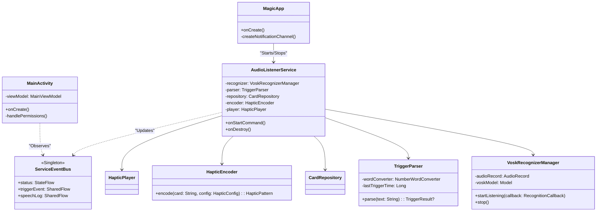
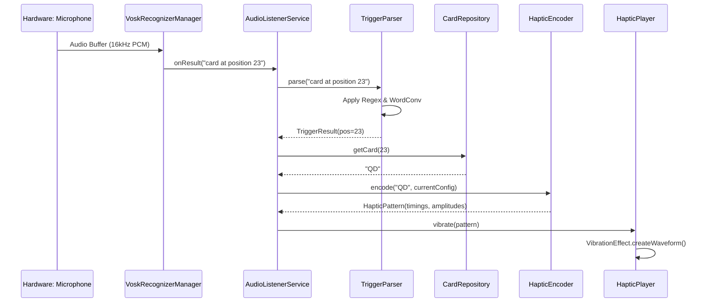
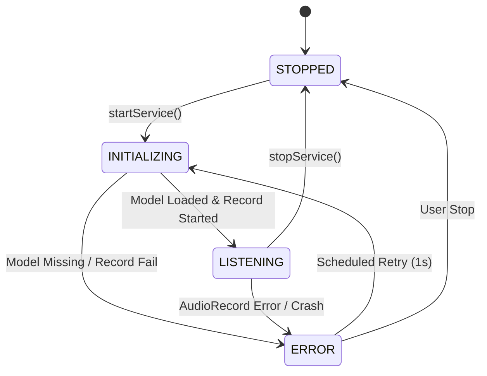

# Low Level Design (LLD) - Magic Haptic Assistant

This document details the software architecture, class relationships, and data flow for the Magic Haptic Assistant Android application.

## 🏛️ Architecture Overview
The application follows the **MVVM (Model-View-ViewModel)** architecture integrated with a **Foreground Service** for continuous background listening.

### Core Components
1.  **AudioListenerService**: Management of the lifecycle and component interconnection.
2.  **VoskRecognizerManager**: Hardware interaction with `AudioRecord` and Vosk engine.
3.  **TriggerParser**: Regex-based analysis of text streams.
4.  **CardRepository**: Business logic for deck management and lookup.
5.  **HapticEncoder & Player**: Low-level vibration waveform construction and execution.

---

## 📊 Class Diagram
The following diagram illustrates the static relationships between the key classes.



---

## 🔄 Sequence Diagram: Voice to Vibration
The flow from the moment the magician speaks until the phone vibrates.



---

## 💾 Data Models (Kotlin)
The essential data structures for communication between layers.

```kotlin
/** Card Rank and Suit Enums */
enum class Rank { A, TWO, THREE, FOUR, FIVE, SIX, SEVEN, EIGHT, NINE, TEN, J, Q, K }
enum class Suit { SPADES, HEARTS, DIAMONDS, CLUBS }

/** Represents a decoded card identifier */
data class Card(val rank: Rank, val suit: Suit) {
    override fun toString() = "${rank.name[0]}${suit.name[0]}"
}

/** Result of a successful trigger match */
data class TriggerResult(
    val position: Int,
    val rawText: String,
    val timestamp: Long = System.currentTimeMillis()
)

/** Configuration for haptic timing */
data class HapticConfig(
    val shortDuration: Long,
    val longDuration: Long,
    val gapDuration: Long,
    val separatorDuration: Long
)

/** The final pattern sent to the Android Vibrator */
data class HapticPattern(
    val timings: LongArray,
    val amplitudes: IntArray,
    val durationMs: Long
)

/** Service Status States */
enum class ServiceStatus { STOPPED, INITIALIZING, LISTENING, ERROR }
```

---

## 🚦 Service State Machine
Lifecycle management for the `AudioListenerService`.



---

## 📦 Persistence Strategy
Using **Jetpack DataStore (Preferences)** for settings storage.

### Keys & Types
| Key Name | Type | Default Value | Description |
| :--- | :--- | :--- | :--- |
| `PREF_CURRENT_DECK_ID` | String | "DEFAULT" | Default, Mnemonica, Aronson, Custom |
| `PREF_CUSTOM_DECK_DATA` | String | "" | CSV of 52 cards |
| `PREF_SPEED_PRESET` | String | "NORMAL" | FAST, NORMAL, SLOW, CUSTOM |
| `PREF_CUSTOM_TIMINGS` | String | JSON | Timings for custom speed |
| `PREF_NOTIF_TITLE` | String | "System Optimizer" | Disguised title |
| `PREF_NOTIF_BODY` | String | "Running..." | Disguised body |
| `PREF_DEBOUNCE_SEC` | Int | 3 | Trigger ignore window |

---

## 🛠️ Implementation Notes
- **Vosk Threading**: The `AudioRecord` read loop must run on a dedicated background thread (e.g., `Executors.newSingleThreadExecutor()`).
- **Foreground Service**: Must show a persistent notification. On Android 14+, it requires `foregroundServiceType: microphone` and appropriate manifest flags.
- **Card Lookup**: Repository will validate the deck list on load. If invalid, it defaults to the `DEFAULT` preset to prevent crashes.
- **Debounce**: Implemented in `TriggerParser` using a simple `lastTriggerTimestamp` check.

---

## 🎨 Premium UI Design System ("Dark Magic")

### Visual Palette
| Element | Color Code | Purpose |
| :--- | :--- | :--- |
| **Obsidian Black** | `#0B0C0E` | Deep background for stealth and focus. |
| **Antique Gold** | `#C5A059` | Primary accent for titles, borders, and buttons. |
| **Velvet Purple** | `#3D1B5D` | Subtle secondary accent (e.g., status glow shadow). |
| **Muted Grey** | `#3A3A3A` | Tertiary text and secondary dividers. |

### Component Aesthetics
1.  **Glassmorphism**: Cards use a 5% White translucent overlay with a subtle 1px border of Antique Gold at 30% opacity.
2.  **Magic Glow**: The Listening status indicator uses an `ObjectAnimator` to pulse between 20% and 60% shadow radius of Antique Gold.
3.  **Typography**: Serif fonts (Spectral) for titles to evoke a sense of tradition/magic; Sans-serif (Inter) for data points to ensure readability.

### Animation Logic
- **Fade-In**: New detected phrases/cards use a 300ms alpha fade to prevent jarring UI jumps.
- **Pulse**: The status glow uses a linear `repeatMode` with a 2-second duration to create a "breathing" effect.
- **Haptic Feedback**: When a pattern is displayed, the UI elements pulse slightly in sync with the vibration timings (S/L).
