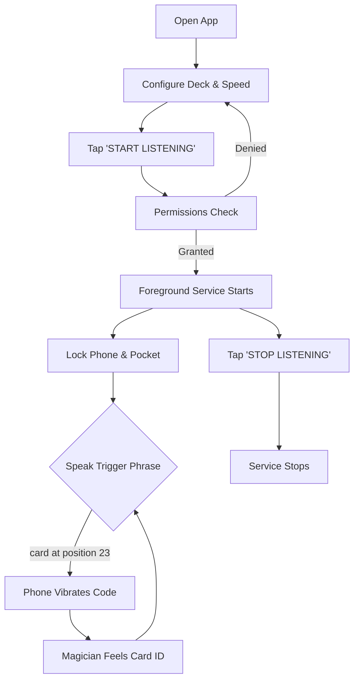
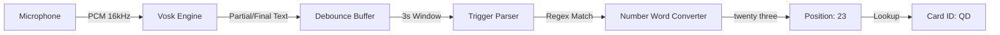

# Business Logic Visualization - Magic Haptic Assistant

This document provides a visual representation of how the application operates from both the user's perspective and the internal system's perspective.

## 🎩 Magician's Workflow
The typical lifecycle of a performance session.



---

## 🎤 Recognition & Trigger Logic
How the system processes spoken words into a position.



---

## 📳 Haptic Encoding Logic (QD Example)
How "Queen of Diamonds" becomes a physical sensation.

### Pulse Reference
| Symbol | Type | Duration (Normal) | Description |
| :--- | :--- | :--- | :--- |
| **S** | Short | 100ms | 255 Amplitude pulse |
| **L** | Long | 300ms | 255 Amplitude pulse |
| **G** | Gap | 150ms | 0 Amplitude (silence) |
| **SEP** | Separator | 500ms | Unambiguous boundary |

### Visual Pattern for QD

```mermaid
gantt
    title Queen of Diamonds (QD) Vibration Timeline
    dateFormat  X
    axisFormat %s
    section Rank (Q)
    S (100ms)    :a1, 0, 100ms
    Gap (150ms)  :blank, after a1, 250ms
    S (100ms)    :a2, after blank, 350ms
    Gap (150ms)  :blank, after a2, 500ms
    L (300ms)    :a3, after blank, 800ms
    section Boundary
    SEP (500ms)  :sep, after a3, 1300ms
    section Suit (D)
    S (100ms)    :b1, after sep, 1400ms
    Gap (150ms)  :blank, after b1, 1550ms
    L (300ms)    :b2, after blank, 1850ms
```


---

## 🃏 Card Lookup Logic
How the position maps to a card based on the current deck.

```mermaid
table
    Position [1 to 52] --> Deck_Order [List<String>] --> Card_ID
```
*   **Default**: AS, 2S, ..., KC
*   **Mnemonica**: 4C, 2H, ..., 9D
*   **Aronson**: JS, KC, ..., KS
*   **Custom**: User defined CSV
